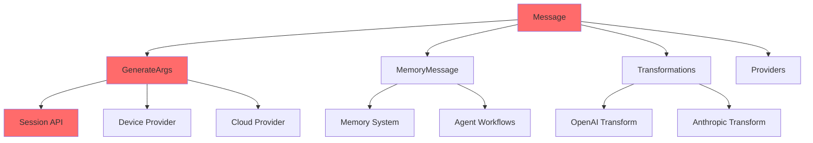

# Dependency Impact Map

> **Purpose**: This document provides a comprehensive map of data dependencies in the Agentary JS codebase to help identify downstream impacts when modifying data structures, types, or interfaces.

**Last Updated**: 2025-11-17  
**Version**: 2.0.0

---

## 📖 Table of Contents

1. [Quick Reference](#quick-reference)
2. [Core Data Structures](#core-data-structures)
3. [Data Flow Pipelines](#data-flow-pipelines)
4. [Impact Matrix](#impact-matrix)
5. [Change Risk Assessment](#change-risk-assessment)
6. [Testing Requirements](#testing-requirements)

---

## 🎯 Quick Reference

### Critical Types (🔴 HIGH IMPACT)

These types are foundational and changes will cascade throughout the system:

| Type | File | Public API | Impact Scope |
|------|------|-----------|--------------|
| `Message` | `types/worker.ts` | ✅ Yes | **Entire codebase** |
| `MessageContent` | `types/worker.ts` | ✅ Yes | **Tool calling, transformations** |
| `GenerateArgs` | `types/worker.ts` | ✅ Yes | **All inference operations** |
| `ModelResponse` | `types/session.ts` | ✅ Yes | **User code, workflows** |
| `InferenceProviderConfig` | `types/provider.ts` | ✅ Yes | **Initialization, providers** |

### Change Impact by Type



---

## 🏗️ Core Data Structures

### 1. Message Type

**Location**: `src/types/worker.ts`

```typescript
interface Message {
  role: MessageRole;
  content: string | MessageContent[];
}
```

#### Direct Dependencies

```
Message
├── GenerateArgs.messages[]          (CRITICAL - All inference)
├── MemoryMessage                    (Agent memory system)
├── transformArgs()                  (Cloud provider transformations)
├── MemoryFormatter.formatMessages() (Memory formatting)
└── Tool execution workflows         (Tool calling)
```

#### Downstream Impact

| Component | Impact | Details |
|-----------|--------|---------|
| **Session API** | 🔴 BREAKS | All `createResponse()` calls |
| **Device Provider** | 🔴 BREAKS | Worker communication |
| **Cloud Provider** | 🔴 BREAKS | API request format |
| **Message Transformation** | 🔴 BREAKS | OpenAI/Anthropic formats |
| **Memory System** | 🔴 BREAKS | Formatting & compression |
| **Agent Workflows** | 🔴 BREAKS | Step execution |
| **Tool Calling** | 🔴 BREAKS | Tool use/result messages |
| **Tests** | 🔴 BREAKS | 30+ test files |
| **Examples** | 🔴 BREAKS | All example applications |
| **User Code** | 🔴 BREAKS | PUBLIC API CHANGE |

#### Files Impacted

- Core: `session.ts`, `agent-session.ts`
- Providers: `device.ts`, `cloud.ts`, `transformation.ts`
- Memory: `memory-manager.ts`, `default-formatter.ts`
- Workflow: `workflow-state.ts`, `step-executor.ts`, `executor.ts`
- Tests: All provider, session, and integration tests
- Examples: All HTML/demo files

---

### 2. MessageContent Types

**Location**: `src/types/worker.ts`

```typescript
type MessageContent = ToolUseContent | ToolResultContent | TextContent;

interface ToolUseContent {
  type: 'tool_use';
  id: string;
  name: string;
  arguments: Record<string, any>;
}

interface ToolResultContent {
  type: 'tool_result';
  tool_use_id: string;
  result: string;
}

interface TextContent {
  type: 'text';
  text: string;
}
```

#### Direct Dependencies

```
MessageContent
├── Message.content                  (When not string)
├── transformArgs()                  (OpenAI transformation)
├── ToolParser                       (Tool call parsing)
└── WorkflowExecutor                 (Tool execution)
```

#### Downstream Impact

| Component | Impact | Details |
|-----------|--------|---------|
| **Tool Calling** | 🔴 BREAKS | Core tool functionality |
| **OpenAI Transformation** | 🔴 BREAKS | Request/response mapping |
| **Message Processing** | 🔴 BREAKS | Complex content handling |
| **Agent Tools** | 🔴 BREAKS | Workflow tool execution |
| **Cloud Provider** | ⚠️ IMPACTS | Tool-related generation |
| **Tests** | 🔴 BREAKS | Tool and provider tests |

#### Files Impacted

- Providers: `cloud.ts`, `transformation.ts`
- Processing: `tools/parser.ts`, `content/processor.ts`
- Workflow: `executor.ts`, `step-executor.ts`
- Tests: `cloud-provider.test.ts`, `message-transformer.test.ts`

---

### 3. GenerateArgs

**Location**: `src/types/worker.ts`

```typescript
interface GenerateArgs {
  messages: Message[];
  max_new_tokens?: number;
  tools?: ToolDefinition[];
  stream?: boolean;
  stop?: string[];
  temperature?: number;
  top_p?: number;
  top_k?: number;
  repetition_penalty?: number;
  seed?: number;
  deterministic?: boolean;
  enable_thinking?: boolean;
}
```

#### Direct Dependencies

```
GenerateArgs
├── Session.createResponse()         (PRIMARY ENTRY POINT)
├── InferenceProvider.generate()     (All providers)
├── transformArgs()                  (Cloud transformations)
├── Worker.postMessage()             (Device worker)
└── WorkflowExecutor                 (Agent workflows)
```

#### Downstream Impact

| Component | Impact | Details |
|-----------|--------|---------|
| **Session API** | 🔴 BREAKS | PRIMARY PUBLIC API |
| **Device Provider** | 🔴 BREAKS | Worker interface |
| **Cloud Provider** | 🔴 BREAKS | HTTP request body |
| **Transformations** | 🔴 BREAKS | OpenAI/Anthropic mapping |
| **Agent Workflows** | 🔴 BREAKS | Step execution |
| **All Tests** | 🔴 BREAKS | Every generation test |
| **User Code** | 🔴 BREAKS | BREAKING CHANGE |

#### Data Flow

```
User Code
  ↓ [GenerateArgs]
Session.createResponse(model, args)
  ↓ [GenerateArgs]
InferenceProviderManager.getProvider(model)
  ↓ [GenerateArgs]
Provider.generate(args)
  ↓
┌─────────────────┬──────────────────┐
│ Device Path     │ Cloud Path       │
├─────────────────┼──────────────────┤
│ Worker.post()   │ transformArgs()  │
│      ↓          │      ↓           │
│ ONNX Runtime    │ fetch(proxyUrl)  │
│      ↓          │      ↓           │
│ Worker Response │ API Response     │
└─────────────────┴──────────────────┘
  ↓
ModelResponse
  ↓
User Code
```

#### Files Impacted

- Core: `session.ts`, `agent-session.ts`
- Providers: `device.ts`, `cloud.ts`, `manager.ts`, `transformation.ts`
- Workers: `worker.ts`
- Workflow: `step-executor.ts`, `executor.ts`
- Tests: ALL test files using generation
- Examples: ALL example files

---

### 4. ModelResponse Types

**Location**: `src/types/session.ts`

```typescript
type ModelResponse = NonStreamingResponse | StreamingResponse;

interface NonStreamingResponse {
  type: 'complete';
  content: string;
  usage?: { ... };
  toolCalls?: Array<...>;
  finishReason?: string;
  reasoning?: string;
}

interface StreamingResponse {
  type: 'streaming';
  stream: AsyncIterable<TokenStreamChunk>;
}

interface TokenStreamChunk {
  token: string;
  tokenId: number;
  isFirst: boolean;
  isLast: boolean;
  ttfbMs?: number;
  tokensPerSecond?: number;
}
```

#### Direct Dependencies

```
ModelResponse
├── Session.createResponse() return   (PUBLIC API)
├── Provider.generate() return        (Provider interface)
├── User consumption code             (Iteration/usage)
├── WorkflowExecutor                  (Response processing)
└── Event emission                    (Token/complete events)
```

#### Downstream Impact

| Component | Impact | Details |
|-----------|--------|---------|
| **User Code** | 🔴 BREAKS | Response handling |
| **Session API** | 🔴 BREAKS | Return type contract |
| **Workflow Execution** | 🔴 BREAKS | Response processing |
| **Event System** | ⚠️ IMPACTS | Event payloads |
| **Provider Interface** | 🔴 BREAKS | Generate return type |
| **Tests** | 🔴 BREAKS | Response validation |

#### Files Impacted

- Core: `session.ts`, `agent-session.ts`
- Providers: `device.ts`, `cloud.ts`
- Workflow: `executor.ts`, `step-executor.ts`, `result-builder.ts`
- Tests: All generation and integration tests
- Examples: All demo applications

---

### 5. InferenceProviderConfig

**Location**: `src/types/provider.ts`

```typescript
type InferenceProviderConfig = DeviceProviderConfig | CloudProviderConfig;

interface DeviceProviderConfig {
  type: 'device';
  model: string;
  quantization: DataType;
  engine?: DeviceType;
  hfToken?: string;
}

interface CloudProviderConfig {
  type: 'cloud';
  proxyUrl: string;
  model: string;
  modelProvider?: 'anthropic' | 'openai';
  headers?: Record<string, string>;
  timeout?: number;
  maxRetries?: number;
}
```

#### Direct Dependencies

```
InferenceProviderConfig
├── Session.registerModels()          (Model registration)
├── createSession({ models })         (Initialization)
├── InferenceProviderManager          (Provider creation)
├── DeviceProvider constructor        (Validation)
└── CloudProvider constructor         (Validation)
```

#### Downstream Impact

| Component | Impact | Details |
|-----------|--------|---------|
| **User Initialization** | 🔴 BREAKS | Session setup code |
| **Provider Registration** | 🔴 BREAKS | Model registration |
| **Provider Validation** | 🔴 BREAKS | Config validation logic |
| **Provider Creation** | 🔴 BREAKS | Factory pattern |
| **Tests** | 🔴 BREAKS | All initialization tests |
| **Examples** | 🔴 BREAKS | Setup code in examples |

#### Files Impacted

- Core: `session.ts`, `agent-session.ts`
- Providers: `device.ts`, `cloud.ts`, `manager.ts`
- Tests: Provider tests, session tests, integration tests
- Examples: All example initialization code
- Docs: API documentation

---

### 6. ToolDefinition & Tool

**Location**: `src/types/worker.ts`

```typescript
interface ToolDefinition {
  name: string;
  description: string;
  parameters: {
    type: 'object';
    properties: Record<string, any>;
    required: string[];
  };
}

interface Tool {
  definition: ToolDefinition;
  implementation?: (...args: any[]) => any;
}
```

#### Direct Dependencies

```
ToolDefinition
├── GenerateArgs.tools[]              (Tool availability)
├── transformArgs()                   (OpenAI transform)
├── ToolParser                        (Response parsing)
├── WorkflowExecutor                  (Tool execution)
└── AgentSession.registerTools()      (Tool registration)
```

#### Downstream Impact

| Component | Impact | Details |
|-----------|--------|---------|
| **Tool Calling API** | 🔴 BREAKS | Tool registration |
| **Tool Parsing** | 🔴 BREAKS | Response parsing |
| **Agent Workflows** | 🔴 BREAKS | Tool execution |
| **OpenAI Transform** | ⚠️ IMPACTS | Tool format mapping |
| **Tests** | 🔴 BREAKS | Tool-related tests |

#### Files Impacted

- Core: `agent-session.ts`
- Processing: `tools/parser.ts`, `tools/parsers/*`
- Providers: `transformation.ts`
- Workflow: `executor.ts`, `step-executor.ts`
- Tests: Tool parser tests, cloud provider tests

---

### 7. MemoryMessage & MemoryConfig

**Location**: `src/types/memory.ts`

```typescript
interface MemoryMessage extends Message {
  metadata?: {
    timestamp?: number;
    stepId?: string;
    priority?: number;
    tokenCount?: number;
    type?: MemoryMessageType;
  };
}

interface MemoryConfig {
  preserveMessageTypes?: MemoryMessageType[];
  formatter?: MemoryFormatter;
  memoryCompressorConfig?: MemoryCompressorConfig;
  maxTokens?: number;
  compressionThreshold?: number;
}
```

#### Direct Dependencies

```
MemoryMessage
├── MemoryManager                    (Core memory ops)
├── MemoryCompressor                 (Compression)
├── MemoryFormatter                  (Formatting)
├── WorkflowStateManager             (Workflow memory)
└── AgentSession.runWorkflow()       (Memory management)
```

#### Downstream Impact

| Component | Impact | Details |
|-----------|--------|---------|
| **Memory System** | 🔴 BREAKS | Core functionality |
| **Agent Workflows** | 🔴 BREAKS | Workflow execution |
| **Memory Compression** | 🔴 BREAKS | Compression strategies |
| **Workflow State** | ⚠️ IMPACTS | State management |
| **Tests** | ⚠️ IMPACTS | Memory-related tests |

#### Files Impacted

- Memory: `memory-manager.ts`, `compression-utils/*`, `formatters/*`
- Workflow: `workflow-state.ts`, `executor.ts`
- Core: `agent-session.ts`
- Tests: Memory and workflow tests

---

## 🔄 Data Flow Pipelines

### Pipeline 1: User Request → Inference → Response

```
┌─────────────────────────────────────────────────────────────┐
│ USER CODE                                                    │
└─────────────────────────────────────────────────────────────┘
                           ↓ [GenerateArgs]
┌─────────────────────────────────────────────────────────────┐
│ Session.createResponse(model, args)                         │
│ - Validates args                                            │
│ - Checks session not disposed                               │
└─────────────────────────────────────────────────────────────┘
                           ↓ [model, GenerateArgs]
┌─────────────────────────────────────────────────────────────┐
│ InferenceProviderManager.getProvider(model)                 │
│ - Looks up provider by model name                           │
│ - Throws error if not found                                 │
└─────────────────────────────────────────────────────────────┘
                           ↓ [InferenceProvider]
┌─────────────────────────────────────────────────────────────┐
│ Provider.generate(args)                                     │
└─────────────────────────────────────────────────────────────┘
                           ↓
        ┌──────────────────┴──────────────────┐
        ↓                                      ↓
┌───────────────────────┐      ┌───────────────────────────┐
│ DEVICE PATH           │      │ CLOUD PATH                │
│                       │      │                           │
│ 1. Worker.postMessage │      │ 1. transformArgs()        │
│    - Send GenerateArgs│      │    - Transform to provider│
│                       │      │      format               │
│ 2. WebGPU/WASM       │      │                           │
│    - ONNX Runtime     │      │ 2. fetch(proxyUrl)        │
│    - Model inference  │      │    - POST to backend      │
│                       │      │    - Stream SSE response  │
│ 3. Worker Response    │      │                           │
│    - Emit chunks      │      │ 3. Parse Response         │
│    - Calculate tokens │      │    - SSE parsing          │
│                       │      │    - JSON parsing         │
└───────────────────────┘      └───────────────────────────┘
        ↓                                      ↓
        └──────────────────┬──────────────────┘
                           ↓ [ModelResponse]
┌─────────────────────────────────────────────────────────────┐
│ Session wraps response with event emission                  │
│ - StreamingResponse → wrapStreamWithEvents()                │
│ - Emits: generation:start, generation:token,                │
│          generation:complete                                │
└─────────────────────────────────────────────────────────────┘
                           ↓ [ModelResponse]
┌─────────────────────────────────────────────────────────────┐
│ USER CODE                                                    │
│ - Iterate stream: for await (const chunk of response.stream)│
│ - Or use complete response: response.content                │
└─────────────────────────────────────────────────────────────┘
```

**Impact Points:**
- **GenerateArgs change** → Affects entire pipeline
- **Message change** → Affects worker/API communication
- **ModelResponse change** → Affects user code
- **Provider interface change** → Affects provider implementations

---

### Pipeline 2: Tool Calling Flow

```
┌─────────────────────────────────────────────────────────────┐
│ USER CODE                                                    │
│ const response = await session.createResponse(model, {      │
│   messages: [...],                                          │
│   tools: [{ name: 'get_weather', ... }]                    │
│ })                                                          │
└─────────────────────────────────────────────────────────────┘
                           ↓ [GenerateArgs with tools]
┌─────────────────────────────────────────────────────────────┐
│ Session.createResponse()                                    │
│ - Disables streaming when tools present                     │
│ - Sets args.stream = false                                  │
└─────────────────────────────────────────────────────────────┘
                           ↓
┌─────────────────────────────────────────────────────────────┐
│ Provider.generate(args)                                     │
│ [Cloud: transforms tools for provider]                      │
│ [Device: passes tools to model]                             │
└─────────────────────────────────────────────────────────────┘
                           ↓
┌─────────────────────────────────────────────────────────────┐
│ LLM generates response with tool calls                      │
└─────────────────────────────────────────────────────────────┘
                           ↓ [NonStreamingResponse]
┌─────────────────────────────────────────────────────────────┐
│ Session validates tool calls                                │
│ - Checks toolCalls exist                                    │
│ - Validates tools were in request                           │
│ - Throws error if validation fails                          │
└─────────────────────────────────────────────────────────────┘
                           ↓ [NonStreamingResponse with toolCalls]
┌─────────────────────────────────────────────────────────────┐
│ USER CODE (or WorkflowExecutor)                             │
│ - Extract toolCalls from response                           │
│ - Find tool implementation                                  │
│ - Execute: await tool.implementation(args)                  │
│ - Build new Message with tool_result content                │
└─────────────────────────────────────────────────────────────┘
                           ↓ [New GenerateArgs with tool results]
┌─────────────────────────────────────────────────────────────┐
│ Next iteration with updated messages                        │
│ session.createResponse(model, {                             │
│   messages: [...previous, toolResultMessage]               │
│ })                                                          │
└─────────────────────────────────────────────────────────────┘
```

**Impact Points:**
- **ToolDefinition change** → Tool validation + transformation
- **MessageContent (tool_use/tool_result)** → Tool flow
- **NonStreamingResponse.toolCalls** → Parsing logic
- **Tool implementation signature** → User code

---

### Pipeline 3: Message Transformation (OpenAI)

```
┌─────────────────────────────────────────────────────────────┐
│ GenerateArgs with messages                                  │
│ messages: [                                                 │
│   { role: 'user', content: 'Hello' },                      │
│   { role: 'assistant', content: [{                         │
│       type: 'tool_use',                                    │
│       id: 'call_1',                                        │
│       name: 'get_weather',                                 │
│       arguments: { city: 'SF' }                            │
│   }]}                                                      │
│ ]                                                          │
└─────────────────────────────────────────────────────────────┘
                           ↓
┌─────────────────────────────────────────────────────────────┐
│ CloudProvider.generate() (modelProvider: 'openai')          │
│ - Calls transformArgs(args, 'openai')                       │
└─────────────────────────────────────────────────────────────┘
                           ↓
┌─────────────────────────────────────────────────────────────┐
│ transformArgs()                                             │
│                                                             │
│ Message → OpenAI.Request.InputItem mapping:                 │
│                                                             │
│ 1. String content:                                          │
│    { role: 'user', content: 'Hello' }                      │
│    → InputMessage {                                         │
│        type: 'message',                                    │
│        role: 'user',                                       │
│        content: 'Hello'                                    │
│      }                                                     │
│                                                             │
│ 2. tool_use content:                                        │
│    { type: 'tool_use', id, name, arguments }               │
│    → FunctionCall {                                         │
│        type: 'function_call',                              │
│        call_id: id,                                        │
│        name: name,                                         │
│        arguments: JSON.stringify(arguments)                │
│      }                                                     │
│                                                             │
│ 3. tool_result content:                                     │
│    { type: 'tool_result', tool_use_id, result }            │
│    → FunctionCallOutput {                                   │
│        type: 'function_call_output',                       │
│        call_id: tool_use_id,                               │
│        output: result                                      │
│      }                                                     │
│                                                             │
│ Returns: { input: InputItem[], ... }                       │
└─────────────────────────────────────────────────────────────┘
                           ↓ [Transformed payload]
┌─────────────────────────────────────────────────────────────┐
│ fetch(proxyUrl, {                                           │
│   method: 'POST',                                           │
│   body: JSON.stringify({                                    │
│     input: [...InputItems],                                 │
│     tools: [...],                                          │
│     max_output_tokens: ...                                 │
│   })                                                       │
│ })                                                         │
└─────────────────────────────────────────────────────────────┘
                           ↓
┌─────────────────────────────────────────────────────────────┐
│ OpenAI API Response                                         │
│ {                                                           │
│   output: [                                                │
│     { type: 'message', content: [...] },                   │
│     { type: 'function_call', ... }                         │
│   ]                                                        │
│ }                                                          │
└─────────────────────────────────────────────────────────────┘
                           ↓
┌─────────────────────────────────────────────────────────────┐
│ transformResponse(response, 'openai')                       │
│ - Converts back to native Message[] format                  │
└─────────────────────────────────────────────────────────────┘
```

**Impact Points:**
- **Message/MessageContent change** → Both transform functions
- **OpenAI types change** → Transformation mapping
- **Tool formats** → FunctionCall/Output mapping

---

### Pipeline 4: Agent Workflow with Memory

```
┌─────────────────────────────────────────────────────────────┐
│ USER CODE                                                    │
│ for await (const iteration of agent.runWorkflow(           │
│   prompt, workflow, memoryConfig                            │
│ )) { ... }                                                  │
└─────────────────────────────────────────────────────────────┘
                           ↓
┌─────────────────────────────────────────────────────────────┐
│ WorkflowExecutor.execute()                                  │
│ - Initialize WorkflowStateManager                           │
│ - Create MemoryManager with config                          │
└─────────────────────────────────────────────────────────────┘
                           ↓
┌─────────────────────────────────────────────────────────────┐
│ FOR EACH workflow.steps:                                    │
└─────────────────────────────────────────────────────────────┘
    ↓
    ┌─────────────────────────────────────────────────────────┐
    │ StepExecutor.executeStep()                              │
    │ 1. Get messages from MemoryManager                       │
    │ 2. Format with step prompt                               │
    └─────────────────────────────────────────────────────────┘
        ↓ [GenerateArgs with formatted messages]
    ┌─────────────────────────────────────────────────────────┐
    │ Session.createResponse(step.model, args)                │
    └─────────────────────────────────────────────────────────┘
        ↓ [ModelResponse]
    ┌─────────────────────────────────────────────────────────┐
    │ IF response has toolCalls:                              │
    │   - Find tool implementation                             │
    │   - Execute tool                                        │
    │   - Add tool result to messages                         │
    │   - Create MemoryMessage with metadata                   │
    └─────────────────────────────────────────────────────────┘
        ↓
    ┌─────────────────────────────────────────────────────────┐
    │ MemoryManager.addMessages()                             │
    │ 1. Add new messages                                      │
    │ 2. Check if compression needed                           │
    │    (currentTokens > maxTokens * threshold)              │
    │ 3. IF needed: compress()                                 │
    │    - Use compression strategy (sliding/summarization)    │
    │    - Preserve system/important messages                  │
    │    - Update token counts                                 │
    └─────────────────────────────────────────────────────────┘
        ↓
    ┌─────────────────────────────────────────────────────────┐
    │ WorkflowResultBuilder.buildResult()                     │
    │ - Format iteration response                              │
    │ - Yield to user                                         │
    └─────────────────────────────────────────────────────────┘
        ↓
    [NEXT STEP OR ITERATION]
```

**Impact Points:**
- **MemoryMessage change** → Memory system
- **MemoryConfig change** → Compression behavior
- **Message/GenerateArgs** → All of above pipeline
- **WorkflowStep change** → Execution logic

---

## 📊 Impact Matrix

### By Risk Level

| Risk Level | Types | Impact Scope | Test Coverage Required |
|-----------|-------|--------------|----------------------|
| 🔴 **CRITICAL** | `Message`, `GenerateArgs`, `ModelResponse`, `InferenceProviderConfig` | **Entire system** | 100% - All test suites |
| 🟡 **HIGH** | `MessageContent`, `ToolDefinition`, `MemoryMessage` | **Major subsystems** | 80%+ - Affected areas |
| 🟢 **MEDIUM** | `SessionEvent`, `TokenStreamChunk`, `MemoryConfig` | **Specific features** | 60%+ - Feature tests |
| ⚪ **LOW** | Utility types, internal configs | **Isolated components** | Standard coverage |

### By Component

| Component | Critical Dependencies | Change Frequency | Testing Priority |
|-----------|---------------------|------------------|------------------|
| **Session API** | `GenerateArgs`, `ModelResponse`, `InferenceProviderConfig` | Low | 🔴 Highest |
| **Providers** | `GenerateArgs`, `Message`, `InferenceProviderConfig` | Low | 🔴 Highest |
| **Transformations** | `Message`, `MessageContent`, `GenerateArgs` | Medium | 🟡 High |
| **Memory System** | `MemoryMessage`, `MemoryConfig`, `Message` | Medium | 🟡 High |
| **Tool Calling** | `ToolDefinition`, `MessageContent`, `GenerateArgs` | Low | 🟡 High |
| **Workflows** | `MemoryMessage`, `GenerateArgs`, `ModelResponse` | Medium | 🟢 Medium |
| **Events** | `SessionEvent` types | High | 🟢 Medium |

### Files by Impact Count

**Most Impacted Files** (Changes require updates here):

1. **`session.ts`** - All core type changes
2. **`device.ts`** - GenerateArgs, Message, ModelResponse
3. **`cloud.ts`** - GenerateArgs, Message, ModelResponse, Provider config
4. **`transformation.ts`** - Message, MessageContent, GenerateArgs
5. **`agent-session.ts`** - All types related to workflows
6. **`memory-manager.ts`** - MemoryMessage, Message, MemoryConfig
7. **`workflow-state.ts`** - MemoryMessage, Message
8. **`step-executor.ts`** - GenerateArgs, Message, ToolDefinition

---

## ⚠️ Change Risk Assessment

### Adding New Fields

#### ✅ **SAFE** (Optional fields)

```typescript
// ✅ SAFE: Adding optional field to GenerateArgs
interface GenerateArgs {
  // existing fields...
  newOptionalFeature?: boolean;  // ✅ Backwards compatible
}
```

**Impact**: Minimal - Existing code continues to work

**Required Actions**:
- ✅ Add field to interface
- ✅ Handle in relevant providers
- ✅ Update documentation
- ✅ Add tests for new feature

---

#### ⚠️ **CAUTION** (Required fields with defaults)

```typescript
// ⚠️ CAUTION: Adding required field (provide default)
interface InferenceProviderConfig {
  // existing fields...
  newRequiredField: string = 'default';  // Provide sensible default
}
```

**Impact**: Medium - Need migration path

**Required Actions**:
- ⚠️ Provide default value logic
- ⚠️ Update all provider initializations
- ⚠️ Migration guide for users
- ⚠️ Deprecation notice (if changing existing behavior)

---

#### 🔴 **DANGEROUS** (Required fields without defaults)

```typescript
// 🔴 DANGEROUS: Adding required field
interface Message {
  role: MessageRole;
  content: string | MessageContent[];
  newRequired: string;  // 🔴 BREAKS ALL EXISTING CODE
}
```

**Impact**: CRITICAL - Breaking change

**Required Actions**:
- 🔴 Major version bump (semver)
- 🔴 Update ALL code creating Messages
- 🔴 Migration guide with examples
- 🔴 Deprecation period with warnings
- 🔴 Update all tests
- 🔴 Update all examples
- 🔴 Update documentation

---

### Modifying Existing Fields

#### 🔴 **DANGEROUS** (Type changes)

```typescript
// 🔴 DANGEROUS: Changing field type
interface GenerateArgs {
  messages: Message[];
  temperature?: number;  // Changed from: string
}
```

**Impact**: CRITICAL - Breaking change

**Required Actions**:
- 🔴 Major version bump
- 🔴 Update ALL usage locations
- 🔴 Type conversion/validation logic
- 🔴 Migration guide
- 🔴 Extensive testing

---

#### 🔴 **DANGEROUS** (Making optional field required)

```typescript
// 🔴 DANGEROUS: Making optional required
interface GenerateArgs {
  messages: Message[];
  temperature: number;  // Was: temperature?: number
}
```

**Impact**: CRITICAL - Breaking change

**Required Actions**:
- 🔴 Major version bump
- 🔴 Provide defaults in code
- 🔴 Update all call sites
- 🔴 Migration guide

---

#### ⚠️ **CAUTION** (Changing optional to have different type)

```typescript
// ⚠️ CAUTION: Union type changes
interface MessageContent {
  type: 'tool_use' | 'tool_result' | 'text' | 'new_type';  // Added new_type
}
```

**Impact**: Medium - Code using discriminated unions may break

**Required Actions**:
- ⚠️ Update type guards
- ⚠️ Update switch statements
- ⚠️ Add handling for new type
- ⚠️ Update tests

---

### Removing Fields

#### 🔴 **DANGEROUS** (Always breaking)

```typescript
// 🔴 DANGEROUS: Removing any field
interface GenerateArgs {
  messages: Message[];
  // REMOVED: tools?: ToolDefinition[];  // 🔴 BREAKS TOOL CALLING
}
```

**Impact**: CRITICAL - Breaking change

**Required Actions**:
- 🔴 Major version bump
- 🔴 Deprecation period (2-3 versions)
- 🔴 Migration path
- 🔴 Update all code
- 🔴 Extensive communication

---

## 🧪 Testing Requirements

### When Modifying Critical Types

#### Required Test Updates

**For `Message` changes:**
```bash
tests/
├── providers/
│   ├── device-provider.test.ts          # ✅ Update
│   ├── cloud-provider.test.ts           # ✅ Update
│   └── message-transformer.test.ts      # ✅ Update
├── core/
│   ├── session.test.ts                  # ✅ Update
│   └── agent-session.test.ts            # ✅ Update
├── integration/
│   ├── exports.test.ts                  # ✅ Update
│   └── provider-switching.test.ts       # ✅ Update
└── memory/
    └── memory-manager.test.ts           # ✅ Update
```

**For `GenerateArgs` changes:**
```bash
tests/
├── ALL provider tests                   # ✅ Update
├── ALL core tests                       # ✅ Update
├── ALL integration tests                # ✅ Update
└── ALL workflow tests                   # ✅ Update
```

**For `ModelResponse` changes:**
```bash
tests/
├── core/session.test.ts                 # ✅ Update
├── providers/*.test.ts                  # ✅ Update
├── integration/*.test.ts                # ✅ Update
└── workflow/executor.test.ts            # ✅ Update
```

---

### Test Coverage Targets

| Change Type | Minimum Coverage | Recommended Coverage |
|------------|------------------|---------------------|
| 🔴 Critical type changes | 100% | 100% |
| 🟡 High impact changes | 90% | 95% |
| 🟢 Medium impact changes | 80% | 90% |
| ⚪ Low impact changes | 70% | 80% |

---

## 📋 Pre-Change Checklist

Before modifying any data structure, complete this checklist:

### 1. Impact Assessment

- [ ] Identified type location and file
- [ ] Checked if type is exported in `src/index.ts` (Public API)
- [ ] Listed all direct consumers (grep for type name)
- [ ] Traced data flow pipelines affected
- [ ] Estimated number of files requiring changes

### 2. Compatibility Analysis

- [ ] Determined if change is backwards compatible
- [ ] Planned migration strategy if breaking
- [ ] Identified deprecation path
- [ ] Estimated version bump (patch/minor/major)

### 3. Code Updates Required

- [ ] Core files needing updates (session, providers)
- [ ] Transformation logic updates
- [ ] Memory system updates
- [ ] Workflow system updates
- [ ] Validation logic updates

### 4. Testing Strategy

- [ ] Unit tests to update/create
- [ ] Integration tests to update/create
- [ ] Provider tests to update
- [ ] Example applications to update
- [ ] Manual testing plan

### 5. Documentation

- [ ] API reference updates
- [ ] Migration guide (if breaking)
- [ ] Changelog entry
- [ ] Example code updates
- [ ] README updates (if needed)

### 6. Communication

- [ ] Breaking change notice (if applicable)
- [ ] Deprecation warnings added to code
- [ ] Release notes prepared
- [ ] User migration timeline

---

## 🔍 Quick Impact Lookup

### "I want to change..."

**→ `Message.role`**
- Impact: 🔴 CRITICAL
- Files: 50+ files
- Tests: ALL tests
- Version: Major bump

**→ `Message.content` (type)**
- Impact: 🔴 CRITICAL
- Files: 40+ files
- Tests: ALL generation tests
- Version: Major bump

**→ `GenerateArgs.messages`**
- Impact: 🔴 CRITICAL
- Files: Entire inference pipeline
- Tests: ALL tests
- Version: Major bump

**→ `GenerateArgs.temperature` (add new optional param)**
- Impact: 🟢 LOW
- Files: Providers, transformation
- Tests: Generation tests
- Version: Minor bump

**→ `ModelResponse` structure**
- Impact: 🔴 CRITICAL
- Files: Session, providers, workflows, user code
- Tests: ALL generation and workflow tests
- Version: Major bump

**→ `ToolDefinition.parameters`**
- Impact: 🟡 HIGH
- Files: Tool calling, transformations, workflows
- Tests: Tool tests, cloud provider tests
- Version: Major bump

**→ `InferenceProviderConfig` (add new provider type)**
- Impact: 🟡 HIGH
- Files: Manager, providers, session
- Tests: Provider tests, integration tests
- Version: Minor bump

**→ `MemoryMessage.metadata`**
- Impact: 🟢 MEDIUM
- Files: Memory system, workflows
- Tests: Memory and workflow tests
- Version: Minor bump

**→ `SessionEvent` types (add new event)**
- Impact: 🟢 LOW
- Files: Event emitter, session
- Tests: Event tests
- Version: Minor bump

---

## 📚 Additional Resources

### Related Documentation

- **API Reference**: `docs/api-reference/`
- **Type Definitions**: `src/types/`
- **Test Examples**: `tests/`
- **Example Applications**: `examples/`

### Tools for Impact Analysis

```bash
# Find all usages of a type
grep -r "TypeName" src/

# Find all imports of a type
grep -r "import.*TypeName" src/

# Find all files using a specific interface
rg "interface.*TypeName" src/

# Count affected test files
grep -r "TypeName" tests/ | wc -l
```

### Version Control

```bash
# Create feature branch for changes
git checkout -b feat/update-message-type

# Commit with conventional commits
git commit -m "feat!: update Message type structure

BREAKING CHANGE: Message.content now requires explicit type"
```

---

## 🤝 Contributing

When adding new types or modifying existing ones:

1. **Update this document** with the new dependency map
2. **Add impact analysis** for the new type
3. **Document transformation pipelines** if applicable
4. **Update test requirements** section

---

**Document Version**: 1.0.0  
**Last Updated**: 2025-11-17  
**Maintainer**: Agentary Team
